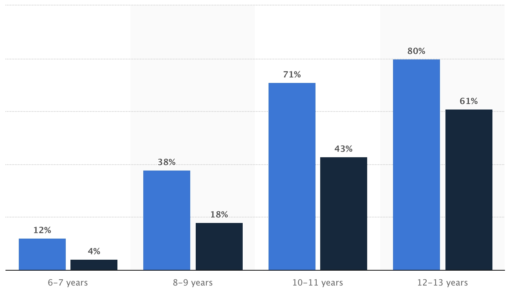
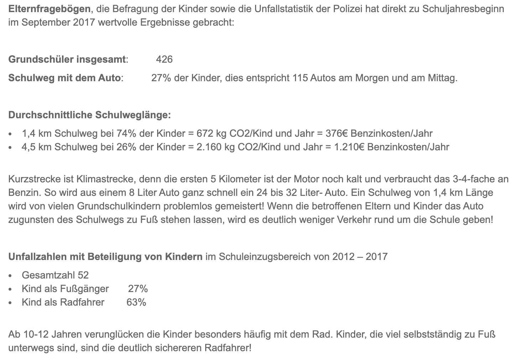

# Market Research

## Pascal
Following a study from [Statista](https://www.statista.com/statistics/477088/children-and-teens-smartphone-usage-by-age-germany/), we should focus on the age 6-11. Therefore, we should both focus on kids who can't read, but also on kids that have the ability to read.

We support the cause of Elterntaxis and Helicoptereltern. See an article from [NTV](https://www.n-tv.de/panorama/Warum-Kinder-zur-Schule-laufen-sollten-article20469986.html)

Over 80 percent of parents are afraid when their kids go alone to school, see [FOCUS](https://www.focus.de/auto/ratgeber/unterwegs/zu-fuss-statt-elterntaxi-umweltverein-eltern-sollten-kinder-nicht-mit-dem-auto-zur-schule-bringen_id_9040695.html)

`codezeile`

Maybe we can start with a slide that shows all the news article related to elterntaxis, accidents and the positiv eeffect of kids walking to school.

"In general, the consensus seems to be that 5-year-olds are too young, 6- and 7-year-olds should walk in a group and that by age 10 most kids are ready." as found [here](https://www.care.com/c/en-nz/stories/3239/when-can-kids-walk-to-school-alone/). Also "Choose the safest route between home and school and practice walking it with your child until he/she can demonstrate traffic-safety awareness."

Immer weniger Kinder in Deutschland gehen selbstständig zur Schule. In den Siebzigerjahren machten sich noch rund 90 Prozent der Grundschülerinnen und Grundschüler zu Fuß auf den Schulweg. Heute werden stattdessen immer mehr Kinder mit dem Elterntaxi zur Schule gefahren. Nach einer Forsa-Umfrage sind es nur noch 37 Prozent, die zu Fuß zur Schule gehen, also etwa jedes dritte Grundschulkind. Dabei fördert der Fußweg zur Schule und zur Kita die Sicherheit der Kinder im Verkehr, ihre körperliche und geistige Entwicklung sowie ihre Konzentrationsfähigkeit in der Schule.
(DKHW)[https://www.dkhw.de/presse/schlagzeilen-archiv/schlagzeilen-details/zum-schulanfang-drei-tipps-wie-kinder-sicher-zu-fuss-zur-schule-laufen-koennen/]

Tipp 1: Eltern sollten mit ihren Kindern gemeinsam einen sicheren Schulweg festlegen und einüben
Not the shortest one, but the safest one. That is something Google can not predict for you!

Sustainability: Elterntaxi stehen lassen.

37% of kids are being driven to school by ELterntaxi
We could calculate the CO2 emission, fuel consumption

15000 Grundschulen

https://de.statista.com/statistik/daten/studie/3377/umfrage/anzahl-der-schueler-nach-einzelnen-schularten/

2.802.189 0.37 = 1 Millionen Grundschulkinder
ohne Elterntaxis

https://www.destatis.de/DE/Themen/Querschnitt/Jahrbuch/jb-bildung.pdf?__blob=publicationFile

https://www.rbb24.de/politik/thema/2014/gehen-oder-bleiben/beitraege/gehen-oder-bleiben-Grundschule-Schulwege-Uckermark-Zukunftskonzepte.html
Es schließen mehr und mehr Grundschulen. Schulwege werden länger = we need bus implementation

https://waldeck-schule.de/index.php?Ergebnisse%2BFrageb%25C3%25B6gen

